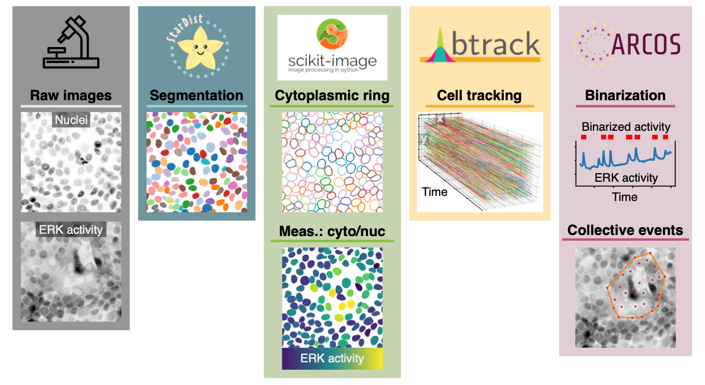

# ARCOS tutorial

A tutorial workflow for detecting collective signalling events in microscopy images and accompanies the manuscript published in [Methods in Microscopy](https://doi.org/10.1515/mim-2024-0003). 
The raw data microscopy data required to perform the analysis are deposited on [Mendeley Data](http://data.mendeley.com/datasets/z29fyn6kzz) (1.2 GB).

## Ingredients

The biological phenomenon studied here are apoptosis-induced collective ERK activity signalling waves in starved, wild type MCF10A epithelium, published earlier in the journal [Developmental Cell](https://doi.org/10.1016/j.devcel.2021.05.007).
The key computational components of the Jupyter notebook `arcos-tutorial.ipynb` are:

- [StarDist](https://stardist.net) for image segmentation,
- [scikit-image](https://scikit-image.org) for image manipulation,
- [btrack](https://btrack.readthedocs.io/en/latest/) for object tracking,
- ARCOS, an algorithm for Automatic Recognition of COllective Signalling, described extensively in the [Journal of Cell Biology](https://doi.org/10.1083/jcb.202207048) and [available online](https://arcos.gitbook.io/home/) as R and Python packages, as well as a plugin for the [napari image viewer](https://napari.org/stable/).

## Results

The video below illustrates:

- raw microscopy time-lapse images of ERK activity in live MCF10A cells measured with the ERK-KTR biosensor (left),
- segmented nuclei with correlated, collective ERK activity waves indicates with coloured dots (middle),
- noodle plot showing when single cells are participating in collective events indicated by different colours (right).

https://github.com/user-attachments/assets/3bcd703a-ed2c-4803-bd6c-52e7a4f06771

## Interactive GUI

The entire analysis can be performed in the [arcos-gui](https://github.com/bgraedel/arcos-gui), an interactive plugin for the [napari image viewer](https://napari.org/stable/).
The 2-minute-long screencast can be watched on [YouTube](https://youtu.be/vVDYst-1SyM).
